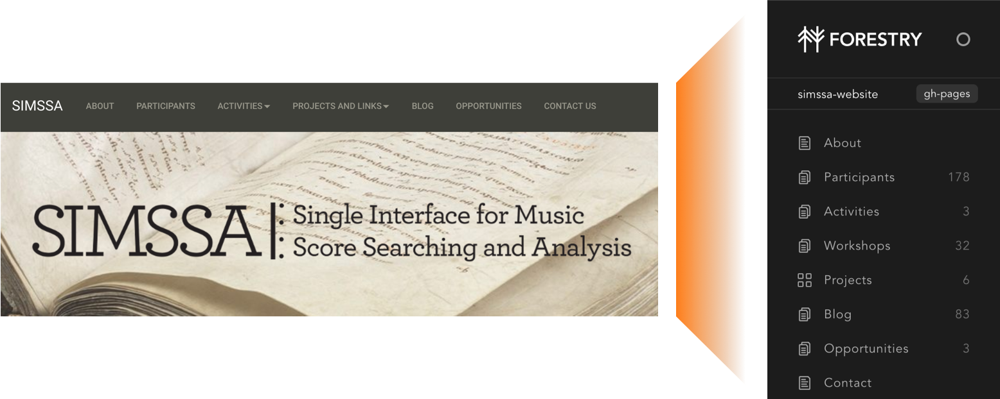
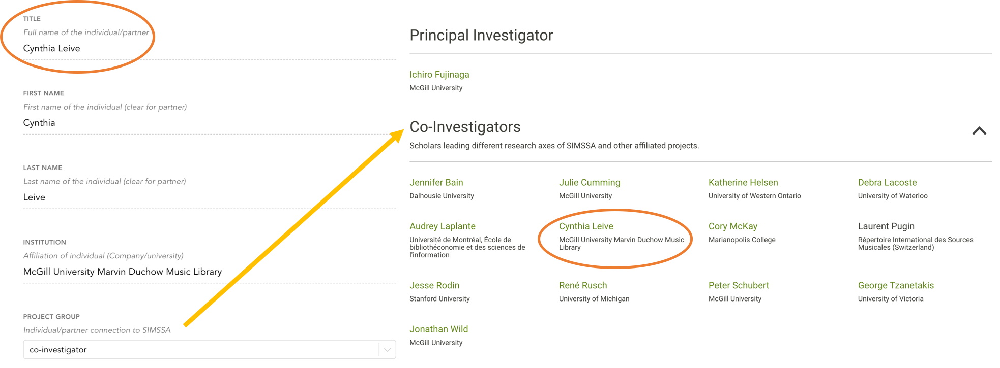

# [SIMSSA](https://ddmal.github.io/simssa-website/)

This is the repository for the SIMSSA website distributed via GitHub Pages. It is a static website built using Jekyll, meaning that there is no backend presence, and the entirety of the site is stored in this repository, blog contents included. The formatting was adapted from the previous statamic theme, with slight adjustments to the blog and responsive upgrades.


## Contents

- [Local Setup](#local-setup)
- [CMS](#cms)
  - [CMS Navigation](#cms-navigation)
    - [Participants](#participants)
    - [Activities](#activities)
    - [Workshops](#workshops)
    - [Projects](#projects)
    - [Blog](#blog)
    - [Opportunities](#opportunities)
    - [Contact](#contact)

## Local Setup

You will need to download a full [Ruby development environment](https://jekyllrb.com/docs/installation/) to install Jekyll. Follow steps 1 and 2 of [these instructions](https://jekyllrb.com/docs/) after installing Ruby.

Assuming you have [Git](https://www.atlassian.com/git/tutorials/install-git) installed, open a terminal and clone the repository into any known location on your computer. THe documents folder is recommended, though it is up to you. 

```
git clone https://github.com/DDMAL/simssa-website.git
```

Enter the directory with `cd simssa-website`, and pull from the repository to your local folder. Specifically, pull from the 'gh-pages' branch, the branch used by GitHub Pages to host the site.

```
git pull origin gh-pages
```

At this point, the site is able to be edited and run locally. Assuming steps 1 and 2 of the Jekyll documentation were followed correctly, run:

```
bundle exec jekyll serve --watch
```

The built site can then be viewed at 'localhost:4000/simssa-website/'. The `--watch` option automatically checks for updates to the local files and can be immediately viewed by refreshing the page. `--watch` is not supported by Windows, thus the command above will need to be rerun after each edit.

If any changes need to be made to the 'Gemfile' at the root directory, run:

```
bundle install
```

to install any updated or newly-added gems for the build. Then, the site can be rebuilt with `bundle exec jekyll serve --watch`.

## CMS

<br>



<br>  

The content management system (CMS) used for this site is [Forestry](https://forestry.io/). This is where blog entries and website contents are added, edited, and maintained. Contact [Evan Savage](mailto:evan.savage@mail.mcgill.ca) or [Emily Hopkins](mailto:emily.hopkins@mcgill.ca) to gain access to the CMS.

Blog entries and website content are written in Markdown, which makes it easy to add text, headers, images, and lists to a new post. Here is a [Markdown Cheat Sheet](https://github.com/adam-p/markdown-here/wiki/Markdown-Cheatsheet) to consult for any necessary formatting.

In the picture above, you can see how each of the links for navigation on the SIMSSA website correspond to an editable tab on the sidebar of the CMS. The next section will explain in further detail how each component is edited and what output should be expected.

### CMS Navigation

Any content that needs to be added or adjusted on the SIMSSA site can mostly be done in the Forestry CMS. When selecting any of the tabs on the sidebar, you will either be taken to a Markdown file or folder. When editing or adding a new Markdown file, the default editing style is a What-You-See-Is-What-You-Get (WYSIWIG [wiss-e-wig]) editor. Formatting for each paragraph, header, link, etc. will automatically take place, and explicit Markdown syntax will automatically be reflected in the editor.

<br>  


<br>  

Every Markdown file has a number of fields in the leftmost column to edit which are referred to as Front Matter. This information is used for automatically placing content where the CMS suggests it should be added. Each tab on the sidebar is restricted to a subset of Front Matter templates respectively that require the content manager to add titles, descriptors, and other information for organizing the new content properly. 

<br>  



<br>  

In the example above, selecting the group "co-investigator" from the dropdown for __Project Group__ automatically will place the individual in that respective group on the website. Other details such as "link" and "institution" are not required, but they can be used to link to others' work and provide more context. 

#### Participants


#### Activities


#### Workshops


#### Projects


#### Blog

To add a new post, select 'Blog' on the sidebar. On the next screen, click the 'Create New' dropdown and select 'Blog'. The left column that appears is the minimum amount of Front Matter (YAML) required for each new post. Choose a title that will display at the top of the blog post.

The right column is where the content of each post is added. The default mode is a What-You-See-Is-What-You-Get (WYSIWYG)
editor, which will give you immediate feedback on the desired Markdown formatting. If it is preferred, click on the ellipsis in the upper right hand corner to change to edit in 'Raw' mode, where the Markdown is explicitly written.

If the blog post will feature images and files, upload them to the 'Media' library which can be accessed on the sidebar. To add them in the WYSIWYG post editor, hit `ctrl+shift+u`. This will open the media library where each image or file can be selected and added inline to the post. The images will be center-justified when posted to the blog.

#### Opportunities


#### Contact
